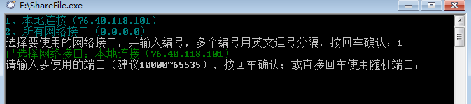
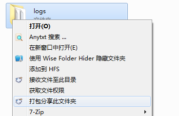

通过二维码或链接将文件传输到手机或局域网内其他终端，同时可以接收其他终端发送的文件，而不需其他终端安装任何额外软件。
Transfer files to your mobile phone or other devices within the local network via QR code or link, while also being able to receive files sent from other devices, without the need for any additional software on those devices.

只支持Windows操作系统。再windows7x86、x64和windows10x64验证成功。
Only supported on Windows operating systems. Verified successfully on Windows 7 x86、 x64, and Windows 10 x64.

（一）、安装

1、浏览器访问“ https://github.com/xiaomingtt/ShareFile/releases ”，下载“ShareFile.exe”到任意目录。

 
 
2、双击运行“ShareFile.exe”，等待滚屏结束。

  
  
3、根据提示输入想要使用的网络链接序号后回车。

  
  
4、提示输入端口时，建议直接回车使用默认设置。

  
  
5、出现下面窗口说明程序安装成功，按回车退出程序。

  
  
（二）、分享文件

1、分享单个文件

（1）、在要分享的文件上点击右键，选择“分享此文件”。

  
  
（2）、等待滚屏结束。

 
 
（3）、分享链接会自动复制到剪贴板，通过即时通讯软件将此链接分享给其他人即可。接收到链接后通过浏览器访问即可下载文件。

 
 
若已打开“显示二维码”功能，会自动弹出二维码窗口，手机或其他移动设备扫描二维码即可下载文件（下同）。

 
 
（4）、当有用户下载文件时，程序窗口会有信息提示。

 
 
（5）如遇防火墙拦截，请点击“允许访问”（下同）。

 
 
2、分享文件夹。

（1）、在需要分享的文件夹上点击右键，选择“打包分享此文件夹”。

  
  
（2）、等待滚屏结束。

  
  
（3）、文件夹会被自动打包，并形成一个下载链接并自动复制到剪贴板，将此链接分享给其他人，通过浏览器访问此链接就可下载打包后的文件。

  
  
3、分享多个文件（需通过命令行操作）

（1）、打开“命令提示符”（cmd）或通过Win+R组合键打开“运行”

   
    
   
（2）、在命令提示符或运行对话框输入程序完整路径（路径中有空格需要添加英文引号） 空格 文件路径 空格 文件路径……
如："E:\sharefile.exe" "C:\Users\Administrator\Desktop\swzs.py" "D:\MiniSQL2K.rar" "F:\WYWZ\config.ini"

  
   
 
（3）、回车确认命令并等待滚屏结束。

 
 
（4）、参数中添加的文件会被自动打包并生成下载链接，链接会自动复制到剪贴板，分享此链接，即可通过浏览器访问下载打包后的文件。

  
  
（三）、接收文件

1、如需接收文件至某目录，可打开此目录后在目录空白处点击右键，选择“接收文件至此目录”。或在要接收目录的文件夹上点击右键，选择“接收文件至此目录”。

   
    
    
2、等待滚屏结束。

 
 
3、形成一个文件接收链接并自动复制到剪贴板。将此链接发送给需要发送文件的人员。

  
   
 
4、需要传输文件的人员拿到链接后通过谷歌浏览器访问，即可进行文件上传操作。

  

Translation provided by ChatGPT.
